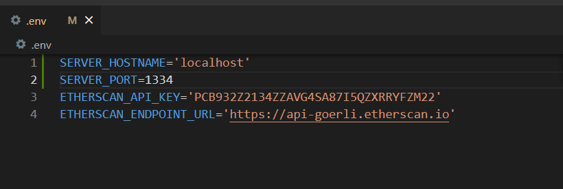
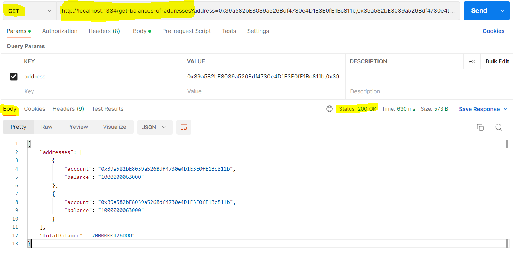
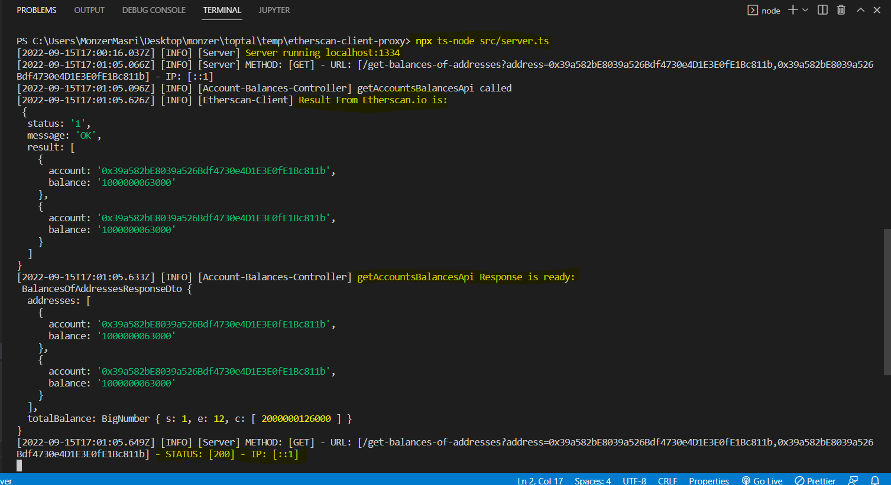

# Project : etherscan-client-proxy
### Developed by : Monzer Masri   
   
   
   
# Steps to run the project : 
### 1- ```git clone https://github.com/mounzer-masri/etherscan-client-proxy```  
### 2- ```npm install```  
### 3- Check out .env file if you want to change any params. 

### 4- run the server ```npx ts-node src/server.ts```
### 5- Open postman and call the API :  
Methd : /GET  
```http://localhost:1334/get-balances-of-addresses?address=0x39a582bE8039a526Bdf4730e4D1E3E0fE1Bc811b,0x39a582bE8039a526Bdf4730e4D1E3E0fE1Bc811b```   
  

### 6- See logs :  
  


# Steps to run test :  
```npm test -- -w```  
